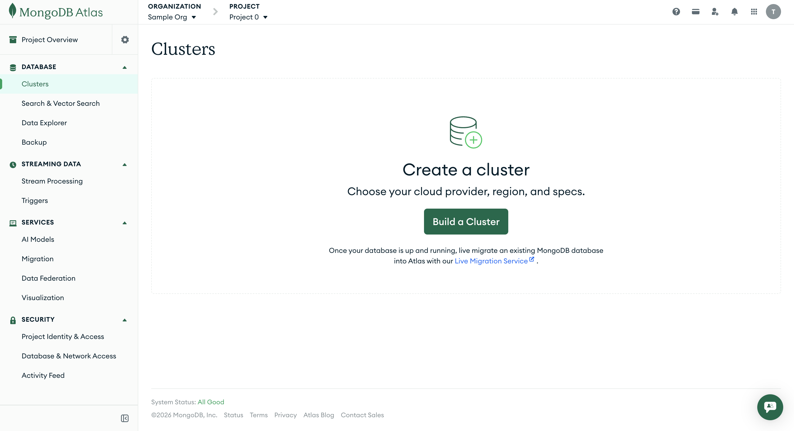
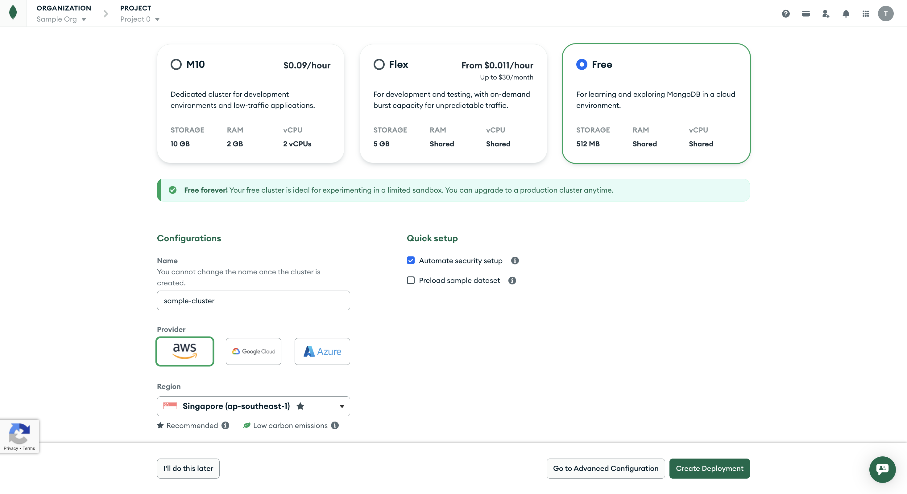
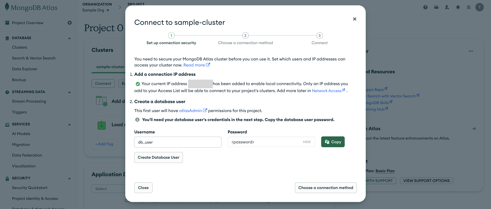
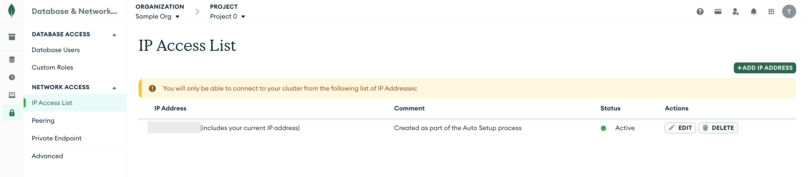
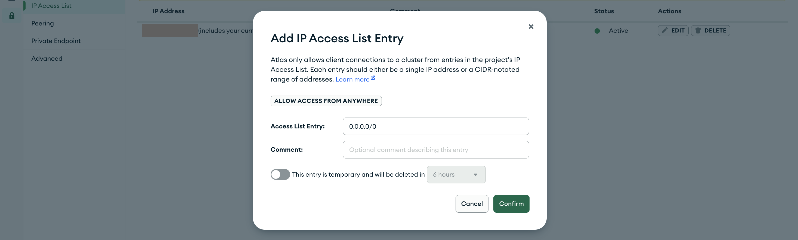

# Setting up MongoDB Instance for User Service

1. Visit the MongoDB Atlas Site <https://www.mongodb.com/atlas> and click on **Get Started**.

2. Sign Up/Sign In with your preferred method.

3. You will be greeted with welcome screens. Feel free to skip them till you reach the Dashboard page.

4. Navigate to the **[Clusters](https://cloud.mongodb.com/go?l=https%3A%2F%2Fcloud.mongodb.com%2Fv2%2F%3Cproject%3E%23%2Fclusters)** page under the **Database** heading. Create a Database cluster by clicking on the green **Build a Cluster** button:

    

5. Make selections as followings in the **Deploy your cluster** page:
    - Select `Free` M0 Cluster (Free Forever - No Card Required).
      > Selecting other type of clusters may be charged!
    - Provide a suitable name to the Cluster.
    - Select `aws` as Provider.
    - Select `Singapore` for Region.
    - Under **Quick Setup**,
      - Select `Automate security setup` to whitelist your current IP Address.
      - Deselect `Preload sample dataset` option.
    - Click on **Create Deployment** button.

      

6. You will be prompted to set up connection for the database by providing database user credentials.
    - Enter a suitable username and a strong password.
    - Click on **Create Database User** button.
    - Click on **Close** button.
    > Please keep this safe as it will be used in User Service later on.

    

## Allowing All IP's

1. Go to **[Database & Network Access](https://cloud.mongodb.com/go?l=https%3A%2F%2Fcloud.mongodb.com%2Fv2%2F%3Cproject%3E%23%2Fsecurity%2Fnetwork%2FaccessList)** under **Security** from the left side pane on Dashboard. Click on **IP Access List** under **Network Access** section in the left side pane.
2. Click on **Add IP Address** button.

    

3. Select the `ALLOW ACCESS FROM ANYWHERE` Button and Click **Confirm**.

    

Now, any IP Address can access this Database.

> ⚠️ Note on Security: Allowing access from anywhere is helpful for initial development. However, for production, you should restrict access to only the specific IP addresses of your application servers or use VPC Peering if your service is on cloud.
