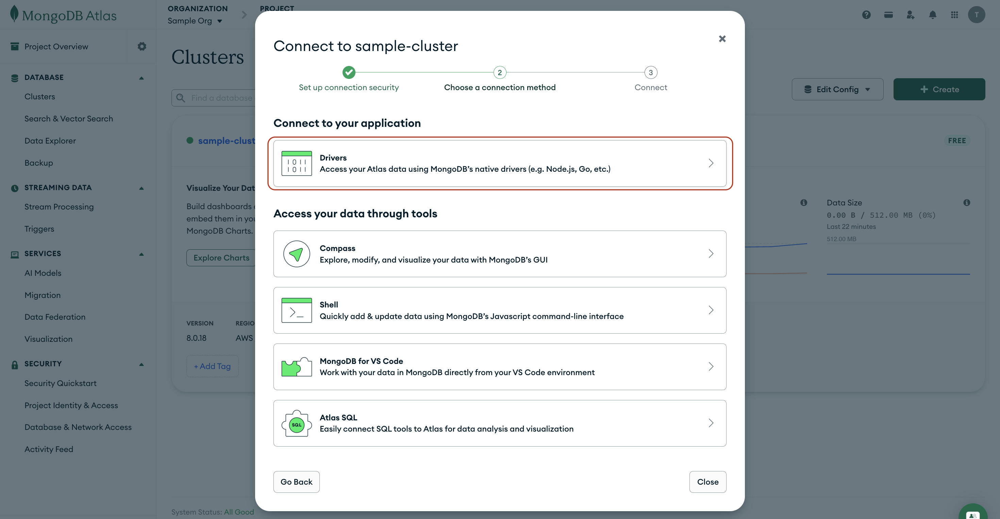
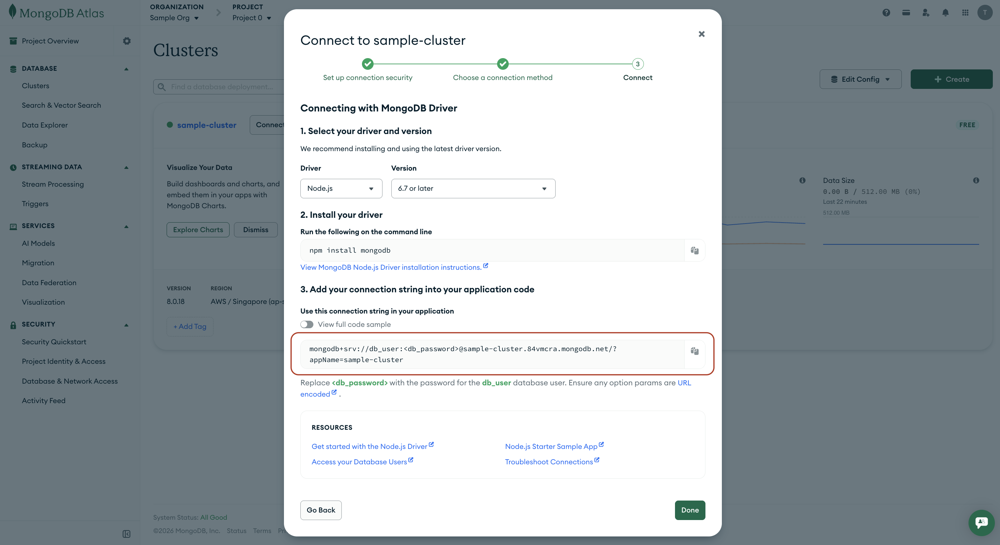
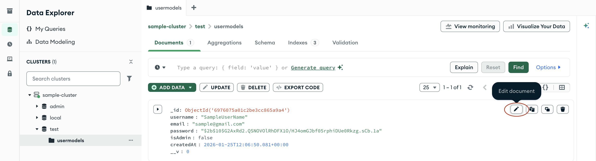
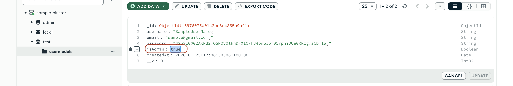

# User Service Guide

## Setting-up

> 📝 Note: If you are familiar with MongoDB and wish to use a local instance, please feel free to do so via the **[MongoDB Community Edition](https://www.mongodb.com/docs/manual/administration/install-community/)**. This guide utilizes MongoDB Cloud Services.
>
> ⚠️ Important Network Notice: MongoDB Atlas connections are blocked on the NUS network. If you are using MongoDB Atlas, you must disconnect from the NUS network (including NUS Wi-Fi or nVPN) and connect using an alternative network such as phone hotspot. Otherwise, your application will fail to connect to the database even if your connection string is correct.

1. Set up a MongoDB Cluster by following the steps in this **[guide](./MongoDBSetup.md)**.

2. After setting up, go to the **[Clusters](https://cloud.mongodb.com/go?l=https%3A%2F%2Fcloud.mongodb.com%2Fv2%2F%3Cproject%3E%23%2Fclusters)**  Page. You would see a list of the clusters you have set up. Select `Connect` on the cluster you just created earlier on for User Service.

    

3. Select the `Drivers` option, as we have to link to a Node.js App (User Service).

    

4. Select `Node.js` in the **Driver** dropdown menu.
5. Copy the connection string.

    > Note, you may see `<password>` in this connection string. We will be replacing this with the admin account password that we created earlier on when setting up the Cluster.

    

6. In the `user-service` directory, create a copy of the `.env.sample` file and name it `.env`.

7. Update the `DB_CLOUD_URI` of the `.env` file, and paste the string we copied earlier in **step 5**. Also remember to replace the `<db_password>` placeholder with the **actual password**.

> ⚠️ Warning: If the password contains special characters, make sure to URL-encode them before placing them in the connection string. For example, if your password is `P@ssword`, you should replace `@` with `%40`, resulting in `P%40ssword`.

## Running User Service

> 📝 Note: Ensure you have **[Node.js (LTS)](https://nodejs.org/en/download)** installed. At the time of writing, the latest LTS version is `v24.13.0`. Select your operating system, package manager, and Node.js version from the dropdowns at the top of the [page]((https://nodejs.org/en/download)), then follow the provided instructions.

1. Open Command Line/Terminal and navigate into the `user-service` directory.

    ```sh
    cd user-service
    ```

2. Install all the necessary dependencies by running the command:

    ```sh
    npm install
    ```

3. Start the User Service in production mode by running:

    ```sh
    npm start
    ```

    Alternatively, you can start it up in development mode (which includes features like automatic server restart when you make code changes) by running:

    ```sh
    npm run dev
    ```

4. Using applications like Postman, you can interact with the User Service on port `3001`. If you wish to change this, please update `PORT` in the `.env` file.

## User Service API Guide

### Create User

- This endpoint allows adding a new user to the database (i.e., user registration).

- HTTP Method: `POST`

- Endpoint: <http://localhost:3001/users>

- Body
  - Required: `username` (string), `email` (string), `password` (string)

    ```json
    {
      "username": "SampleUserName",
      "email": "sample@gmail.com",
      "password": "SecurePassword"
    }
    ```

- Responses:

    | Response Code               | Explanation                                           |
    |-----------------------------|-------------------------------------------------------|
    | 201 (Created)               | User created successfully, created user data returned |
    | 400 (Bad Request)           | Missing fields                                        |
    | 409 (Conflict)              | Duplicate username or email encountered               |
    | 500 (Internal Server Error) | Database or server error                              |

### Login

- This endpoint allows a user to authenticate with an email and password and returns a JWT access token. The token is valid for 1 day and can be used subsequently to access protected resources. For the example usage, refer to the [Authorization header section in the Get User endpoint](#auth-header).
- HTTP Method: `POST`
- Endpoint: <http://localhost:3001/auth/login>
- Body
  - Required: `email` (string), `password` (string)

    ```json
    {
      "email": "sample@gmail.com",
      "password": "SecurePassword"
    }
    ```

- Responses:

    | Response Code               | Explanation                                        |
    |-----------------------------|----------------------------------------------------|
    | 200 (OK)                    | Login successful, JWT token and user data returned |
    | 400 (Bad Request)           | Missing fields                                     |
    | 401 (Unauthorized)          | Incorrect email or password                        |
    | 500 (Internal Server Error) | Database or server error                           |

### Verify Token

- This endpoint allows one to verify a JWT access token to authenticate and retrieve the user's data associated with the token.
- HTTP Method: `GET`
- Endpoint: <http://localhost:3001/auth/verify-token>
- Headers
  - Required: `Authorization: Bearer <JWT_ACCESS_TOKEN>`

- Responses:

    | Response Code               | Explanation                                        |
    |-----------------------------|----------------------------------------------------|
    | 200 (OK)                    | Token verified, authenticated user's data returned |
    | 401 (Unauthorized)          | Missing/invalid/expired JWT                        |
    | 500 (Internal Server Error) | Database or server error                           |

### Update User Privilege

> You may need to manually assign admin status to the first user by directly editing the database document before using this endpoint.
>
> To do this on Atlas, navigate to **Database > Data Explorer > cluster_name > test > usermodels**
>
> 
>
> Find the user document, and set the `isAdmin` field to `true`.
>
> 

- This endpoint allows updating a user’s privilege, i.e., promoting or demoting them from admin status.

- HTTP Method: `PATCH`

- Endpoint: <http://localhost:3001/users/{userId}>

- Parameters
  - Required: `userId` path parameter

- Body
  - Required: `isAdmin` (boolean)

    ```json
    {
      "isAdmin": true
    }
    ```

- Headers
  - Required: `Authorization: Bearer <JWT_ACCESS_TOKEN>`
  - Auth Rules:

    - Admin users: Can update any user's privilege. The server verifies the user associated with the JWT token is an admin user and allows the privilege update.
    - Non-admin users: Not allowed access.

- Responses:

    | Response Code               | Explanation                                                     |
    |-----------------------------|-----------------------------------------------------------------|
    | 200 (OK)                    | User privilege updated successfully, updated user data returned |
    | 400 (Bad Request)           | Missing fields                                                  |
    | 401 (Unauthorized)          | Access denied due to missing/invalid/expired JWT                |
    | 403 (Forbidden)             | Access denied for non-admin users                               |
    | 404 (Not Found)             | User with the specified ID not found                            |
    | 500 (Internal Server Error) | Database or server error                                        |

### Get User

- This endpoint allows retrieval of a single user's data from the database using the user's ID.

  > 💡 The user ID refers to the MongoDB Object ID, a unique identifier automatically generated by MongoDB for each document in a collection.

- HTTP Method: `GET`

- Endpoint: <http://localhost:3001/users/{userId}>

- Parameters
  - Required: `userId` path parameter
  - Example: `http://localhost:3001/users/60c72b2f9b1d4c3a2e5f8b4c`

- Headers

  - Required: `Authorization: Bearer <JWT_ACCESS_TOKEN>`

  - Explanation: This endpoint requires the client to include a JWT (JSON Web Token) in the HTTP request header for authentication and authorization. This token is generated during the authentication process (i.e., login) and contains information about the user's identity. The server verifies this token to ensure that the client is authorized to access the data.

  - Auth Rules:

    - Admin users: Can retrieve any user's data. The server verifies the user associated with the JWT token is an admin user and allows access to the requested user's data.

    - Non-admin users: Can only retrieve their own data. The server checks if the user ID in the request URL matches the ID of the user associated with the JWT token. If it matches, the server returns the user's own data.

- Responses:

    | Response Code               | Explanation                                              |
    |-----------------------------|----------------------------------------------------------|
    | 200 (OK)                    | Success, user data returned                              |
    | 401 (Unauthorized)          | Access denied due to missing/invalid/expired JWT         |
    | 403 (Forbidden)             | Access denied for non-admin users accessing others' data |
    | 404 (Not Found)             | User with the specified ID not found                     |
    | 500 (Internal Server Error) | Database or server error                                 |

### Get All Users

- This endpoint allows retrieval of all users' data from the database.
- HTTP Method: `GET`
- Endpoint: <http://localhost:3001/users>
- Headers
  - Required: `Authorization: Bearer <JWT_ACCESS_TOKEN>`
  - Auth Rules:

    - Admin users: Can retrieve all users' data. The server verifies the user associated with the JWT token is an admin user and allows access to all users' data.

    - Non-admin users: Not allowed access.

- Responses:

    | Response Code               | Explanation                                      |
    |-----------------------------|--------------------------------------------------|
    | 200 (OK)                    | Success, all user data returned                  |
    | 401 (Unauthorized)          | Access denied due to missing/invalid/expired JWT |
    | 403 (Forbidden)             | Access denied for non-admin users                |
    | 500 (Internal Server Error) | Database or server error                         |

### Update User

- This endpoint allows updating a user and their related data in the database using the user's ID.

- HTTP Method: `PATCH`

- Endpoint: <http://localhost:3001/users/{userId}>

- Parameters
  - Required: `userId` path parameter

- Body
  - At least one of the following fields is required: `username` (string), `email` (string), `password` (string)

    ```json
    {
      "username": "SampleUserName",
      "email": "sample@gmail.com",
      "password": "SecurePassword"
    }
    ```

- Headers
  - Required: `Authorization: Bearer <JWT_ACCESS_TOKEN>`
  - Auth Rules:

    - Admin users: Can update any user's data. The server verifies the user associated with the JWT token is an admin user and allows the update of requested user's data.

    - Non-admin users: Can only update their own data. The server checks if the user ID in the request URL matches the ID of the user associated with the JWT token. If it matches, the server updates the user's own data.

- Responses:

    | Response Code               | Explanation                                             |
    |-----------------------------|---------------------------------------------------------|
    | 200 (OK)                    | User updated successfully, updated user data returned   |
    | 400 (Bad Request)           | Missing fields                                          |
    | 401 (Unauthorized)          | Access denied due to missing/invalid/expired JWT        |
    | 403 (Forbidden)             | Access denied for non-admin users updating others' data |
    | 404 (Not Found)             | User with the specified ID not found                    |
    | 409 (Conflict)              | Duplicate username or email encountered                 |
    | 500 (Internal Server Error) | Database or server error                                |

### Delete User

- This endpoint allows deletion of a user and their related data from the database using the user's ID.
- HTTP Method: `DELETE`
- Endpoint: http://localhost:3001/users/{userId}
- Parameters

  - Required: `userId` path parameter
- Headers

  - Required: `Authorization: Bearer <JWT_ACCESS_TOKEN>`

  - Auth Rules:

    - Admin users: Can delete any user's data. The server verifies the user associated with the JWT token is an admin user and allows the deletion of requested user's data.

    - Non-admin users: Can only delete their own data. The server checks if the user ID in the request URL matches the ID of the user associated with the JWT token. If it matches, the server deletes the user's own data.
- Responses:

    | Response Code               | Explanation                                             |
    |-----------------------------|---------------------------------------------------------|
    | 200 (OK)                    | User deleted successfully                               |
    | 401 (Unauthorized)          | Access denied due to missing/invalid/expired JWT        |
    | 403 (Forbidden)             | Access denied for non-admin users deleting others' data |
    | 404 (Not Found)             | User with the specified ID not found                    |
    | 500 (Internal Server Error) | Database or server error                                |

